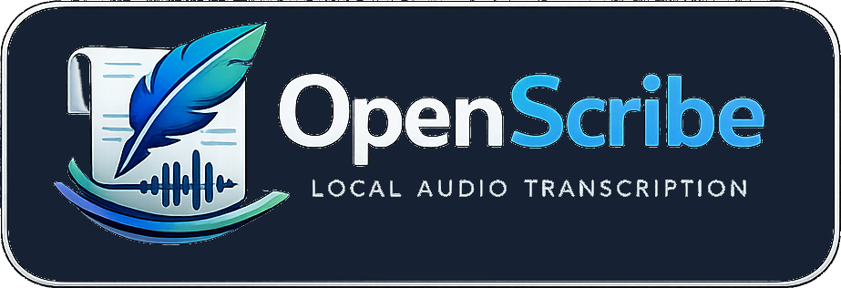

<p align="center">
  
</p>

<p align="center">
  A privacy-focused local speech-to-text application with global hotkeys for seamless dictation across any application.
</p>

## Features

### Core Functionality
- 🎤 **Global Hotkey Activation** - Trigger recording from anywhere with customizable hotkeys
- 🎙️ **Local Speech-to-Text** - Privacy-first transcription using Whisper.cpp (runs entirely offline)
- 📝 **Auto-Paste** - Automatically paste transcribed text into any application
- 🎨 **Visual Feedback** - Real-time waveform display during recording
- 🔄 **Toggle Mode** - Choose between push-to-talk or hold-to-record modes

### Multi-Language Support
- 🌐 **10 Languages Supported** - English, Spanish, French, German, Chinese, Japanese, Portuguese, Russian, Italian, Korean
- 🗣️ **Language Selection** - Easy language switching via Settings panel

### Text Processing
- 📖 **Custom Dictionary** - Create word/phrase replacements for consistent transcription
- ⚡ **Dictation Macros** - Insert pre-defined text blocks with voice commands ("insert [name]")
- ✏️ **Multi-line Support** - Macros support newlines and whitespace

### Models & Performance
- 🧠 **Multiple Model Sizes** - Choose from tiny, base, small, medium models based on accuracy vs speed needs
- 📦 **Automatic Model Download** - Models downloaded and verified automatically
- ✅ **SHA256 Verification** - All models verified with checksums for integrity

### History & Management
- 📊 **Transcription History** - Review, edit, copy, and manage past transcriptions
- 🔍 **Search & Filter** - Find previous transcriptions easily
- 🗑️ **Bulk Operations** - Clear history or delete individual entries

### System Integration
- 🖥️ **System Tray** - Minimize to tray for background operation
- ⚙️ **Settings Panel** - Customize hotkeys, models, languages, and behavior
- 🎯 **Cross-Platform** - Works on Windows, macOS (Intel & Apple Silicon), and Linux

### Security & Privacy
- 🔒 **100% Local Processing** - No cloud services, no data sent externally
- 🛡️ **Security Hardening** - Context isolation, path validation, checksum verification
- 🔐 **HIPAA-Ready** - Suitable for sensitive data and healthcare workflows
- 🚫 **No Telemetry** - Zero tracking or analytics

## Setup

### Prerequisites

- Node.js (v16 or higher)
- npm or yarn
- **Mac**: macOS 10.13 or later (Intel or Apple Silicon)
- **Linux**: Ubuntu 20.04+ or equivalent (with `unzip` installed)
- **Windows**: Windows 10 or later

### Installation

1. Clone or navigate to the project directory:
```bash
git clone https://github.com/NetsecExplained/OpenScribe.git
cd OpenScribe
```

2. Install dependencies:
```bash
npm install
```
   - **Windows**: Automatically downloads pre-built whisper.cpp binary
   - **Linux/Mac**: Automatically compiles whisper.cpp from source (requires git, cmake, make)

3. Run the app:
```bash
npm start
```

For development mode (with DevTools):
```bash
npm run dev
```

### Platform-Specific Notes

**Windows:**
- Pre-built whisper.cpp binary is downloaded automatically
- PowerShell is used for extraction (built-in)
- No additional dependencies needed

**Linux (Ubuntu/Debian):**
- Whisper.cpp will be compiled from source during `npm install`
- **Required tools** (install if missing):
  ```bash
  sudo apt update
  sudo apt install git cmake build-essential
  ```
- Compilation takes 2-5 minutes depending on your system
- You may also need to manually fix the Chromium sandbox:
  ```bash
  sudo chown root ./node_modules/electron/dist/chrome-sandbox
  sudo chmod 4755 ./node_modules/electron/dist/chrome-sandbox
  ```

**Mac:**
- Whisper.cpp will be compiled from source during `npm install`
- **Required tools**: XCode Command Line Tools
  ```bash
  xcode-select --install
  ```
- If you have Homebrew, you may also need cmake:
  ```bash
  brew install cmake
  ```
- Compilation takes 2-5 minutes depending on your system
- You may need to allow the app in System Preferences → Security & Privacy

### Building Distributable Packages

To create standalone applications that users can install:

```bash
# Build for your current platform
npm run dist

# Build for specific platforms
npm run dist:win    # Windows (.exe installer + portable)
npm run dist:mac    # macOS (.dmg + .zip)
npm run dist:linux  # Linux (.AppImage + .deb)
```

Built packages are output to the `dist/` folder.

**Note:** Cross-platform builds have limitations. For best results, build on the target platform (e.g., build Windows packages on Windows).

## Usage

### First-Time Setup

1. **Download a Model**: On first launch, go to the Models tab and download a model:
   - `tiny` - Fastest, lowest accuracy (~75 MB)
   - `base` - Good balance (~142 MB)
   - `small` - Better accuracy (~466 MB)
   - `medium` - Best accuracy, slower (~1.5 GB)

2. **Select Model**: Click "Select" on your downloaded model to activate it

3. **Configure Language** (Optional): Go to Settings tab and choose your language

### Recording Dictation

1. **Hold Your Hotkey**: Press and hold your configured hotkey (default: `Ctrl+Shift`)
2. **Speak**: A recording popup appears with waveform visualization
3. **Release**: Release the hotkey to stop recording
4. **Done**: Transcribed text is automatically pasted into your active application

You can customize your hotkey in **Settings** → **Change Hotkey**.

### Recording Modes

**Hold Mode (Default)**
- Hold your hotkey while speaking, release to finish

**Toggle Mode**
- Press hotkey once to start recording, press again to stop
- Enable in **Settings** → **Toggle Mode**

### Custom Dictionary

Create automatic word/phrase replacements:

1. Go to **Dictionary** tab
2. Enter a word/phrase to replace (e.g., "OpenAI")
3. Enter the replacement text (e.g., "OpenScribe")
4. Click **Add Entry**
5. All future transcriptions will apply this replacement

### Dictation Macros

Insert pre-defined text blocks by voice:

1. Go to **Dictionary** tab → **Voice Macros** section
2. Create a macro:
   - **Name**: `signature`
   - **Text**: `Best regards,\nJohn Smith`
3. Click **Save Macro**
4. During dictation, say: "Please contact me insert signature"
5. Result: "Please contact me Best regards,\nJohn Smith"

### Transcription History

- View all past transcriptions in the **History** tab
- Click **Copy** to copy text to clipboard
- Click **Delete** to remove individual entries
- Click **Clear All** to delete all history
- Disable history in Settings if desired

## Development Roadmap

### Phase 1: Hello World ✓
- [x] Basic Electron app structure
- [x] Window creation and UI

### Phase 2: Core Functionality ✓
- [x] Global hotkey registration
- [x] Audio recording from microphone
- [x] Recording UI popup with waveform
- [x] System tray integration

### Phase 3: Speech-to-Text ✓
- [x] Whisper.cpp integration
- [x] Model download and management
- [x] Transcription processing
- [x] Clipboard integration and auto-paste

### Phase 4: Settings & Polish ✓
- [x] Settings panel
- [x] Hotkey customization
- [x] Language selection (10 languages)
- [x] Model size selection
- [x] Transcription history
- [x] Error handling and notifications

### Phase 5: Advanced Features ✓
- [x] Custom dictionary & text replacement
- [x] Dictation macros ("insert [name]")
- [x] Toggle mode (push-to-talk vs hold-to-record)
- [x] Cross-platform support (Windows/Mac/Linux)
- [x] Security hardening (SHA256, path validation, context isolation)

### Phase 6: Future Enhancements
- [ ] Cloud API integration (AWS/Azure/OpenAI) - optional
- [ ] Voice commands for punctuation
- [ ] Advanced audio processing (noise reduction)
- [ ] Auto-start on system boot
- [ ] Custom model training/fine-tuning
- [ ] Collaborative dictation features

## Project Structure

```
OpenScribe/
├── src/
│   ├── main.js                  # Electron main process
│   ├── preload-main.js          # Main window preload (context bridge)
│   ├── preload-recording.js     # Recording popup preload
│   ├── recorder.js              # Audio recording manager
│   ├── transcriber.js           # Whisper.cpp integration
│   ├── model-manager.js         # Model download & verification
│   ├── config-manager.js        # Settings & configuration
│   ├── dictionary-manager.js    # Custom word replacements
│   ├── macro-manager.js         # Dictation macros
│   ├── history-manager.js       # Transcription history
│   ├── clipboard.js             # Cross-platform clipboard & paste
│   ├── checksum-verifier.js     # SHA256 verification
│   ├── path-validator.js        # Security path validation
│   └── resource-path.js         # Resource path resolution for packaging
├── public/
│   ├── index.html               # Main window UI
│   ├── main-window.js           # Main window renderer
│   ├── recording-popup.html     # Recording UI
│   └── recording-popup.js       # Recording renderer
├── scripts/
│   └── setup-whisper.js         # Cross-platform whisper.cpp setup
├── bin/                         # Whisper.cpp binaries (auto-downloaded)
├── models/                      # Whisper models (auto-downloaded)
├── dist/                        # Built distributables (after npm run dist)
├── package.json                 # Dependencies and scripts
├── LICENSE                      # MIT License
├── SECURITY.md                  # Security policy
└── README.md                    # This file
```

## Privacy & Security

- All audio processing happens locally by default
- No data sent to external servers without explicit opt-in
- Suitable for HIPAA-compliant and sensitive data use cases
- Optional cloud API support for users who need faster processing

## Troubleshooting

### Installation Issues

**Linux: "cmake not found"**
```bash
sudo apt update && sudo apt install cmake
```

**Linux: "make not found"**
```bash
sudo apt update && sudo apt install build-essential
```

**Mac: "make not found" or "No developer tools found"**
```bash
xcode-select --install
```

If already installed, try resetting:
```bash
sudo xcode-select --reset
```

**Mac: "cmake not found"**
```bash
brew install cmake
```

**Whisper.cpp compilation fails**

If automatic compilation fails during `npm install`, you can compile manually:

1. Clone whisper.cpp:
   ```bash
   git clone https://github.com/ggerganov/whisper.cpp.git
   cd whisper.cpp
   make
   ```

2. Copy the compiled binary:
   - **Linux**: Copy `build/bin/whisper-cli` to `OpenScribe/bin/Release/main`
   - **Mac**: Copy `build/bin/whisper-cli` to `OpenScribe/bin/Release/main`
   - **Windows**: Download from [releases](https://github.com/ggml-org/whisper.cpp/releases)

3. Make it executable (Linux/Mac only):
   ```bash
   chmod +x OpenScribe/bin/Release/main
   ```

## Known Issues

- **Terminal Paste Limitation**: Auto-paste uses Ctrl+V (or Cmd+V on Mac) which works in GUI applications but not in some terminal emulators (Windows CMD, PowerShell). For terminals, you may need to paste manually using Shift+Insert or the terminal's paste shortcut. The transcription is still copied to clipboard automatically.

## License

MIT
